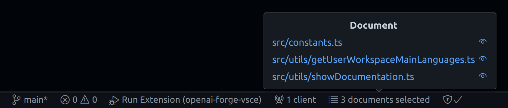

# Welcome to OpenAI Forge!

## Getting Started

### 1. Install OpenAI Forge Browser Extension

- [Brave](https://chrome.google.com/webstore/detail/openai-forge/nnppeeohaoogddcihgdpcolkmibbkked)
- [Chrome](https://chrome.google.com/webstore/detail/openai-forge/nnppeeohaoogddcihgdpcolkmibbkked)
- [Firefox](https://addons.mozilla.org/en-US/firefox/addon/openai-forge/)

### 2. Open a workspace (if not already done)

### 3. Configure the Evaluator

What the heck is an **Evaluator**?

It's a combination of files extension with a command able to generate error when compiling or linting those files.

OpenAI Forge use this command to detect errors in your code and send them to ChatGPT, along with the documents you selected, to automatically prompt for a fixed version of your code.

This command is called:
`OpenAI Forge: Evaluate errors and send them with the current document or stack` (<kbd>SHIFT + F, E</kbd>).

### 4. Open a [ChatGPT](https://chat.openai.com) chat in your browser

### 5. Add a few documents to your stack (or not)

Run the command `OpenAI Forge: Add/Remove current document to/from the stack` (<kbd>SHIFT + F, A</kbd>)
to select/unselect your currently edited document.

You can see them in the status bar:

 

Or don't, if you just want to send your currently edited document alone.

### 6. Send them to ChatGPT

Run the command `OpenAI Forge: Send current document or stack` (<kbd>SHIFT + F, S</kbd>).

### 7. Useful Key Bindings

All OpenAI Forge default key bindings start with <kbd>SHIFT + F</kbd> (**F** for **F**orge):

- <kbd>SHIFT + F, A</kbd>: `OpenAI Forge: Add/Remove current document to/from the stack`
- <kbd>SHIFT + F, E</kbd>: `OpenAI Forge: Evaluate errors and send them with the current document or stack`
- <kbd>SHIFT + F, S</kbd>: `OpenAI Forge: Send current document or stack`

### 8. Star [my repo](https://github.com/ivangabriele/openai-forge-vsce) if you like it 🥰

### 9. May the Forge be with you 🔨!
